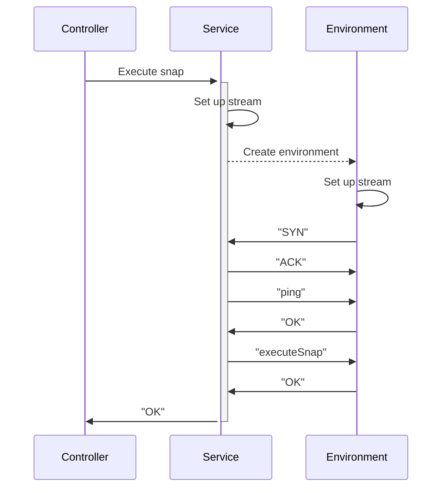
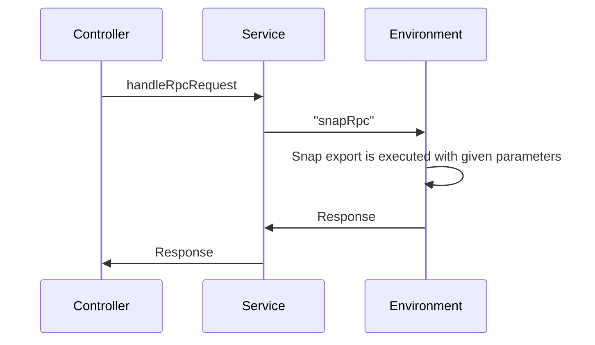
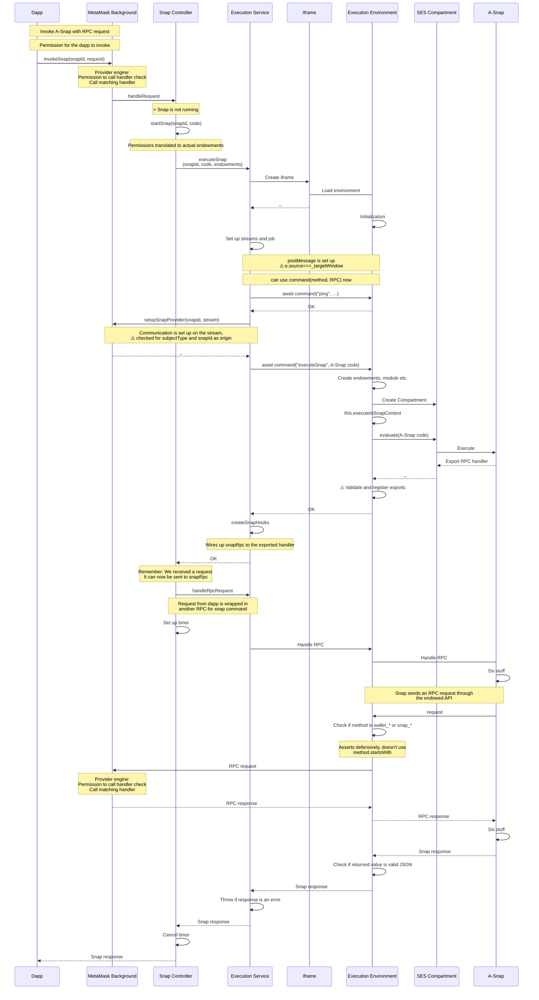

# Architecture

This document provides an overview of the architecture of the MetaMask Snaps system. It explains the key components and their roles in the system.

## Entity diagram

This entity diagram illustrates the "backend" components of the Snaps system and how they communicate with each other.

## Snap Controller

The Snap Controller is the brain of the MetaMask Snaps platform. It is responsible for:

- Starting and stopping snaps.
- Managing permissions.
- Managing snap state.
- Handling incoming requests from dapps, and routing them to the correct snap (through the Execution Service).
- Installing and uninstalling snaps.
- Checking if snaps are allowed to be installed (through the Snaps Registry).

As such, it is the main entry point for the MetaMask Snaps platform. It is hooked up to the controller messaging system in the MetaMask extension, so it can handle requests from other parts of the extension.

The snap controller uses a state machine to manage the state of the snaps. The state machine is implemented using the XState library. This allows us to easily reason about the state of the snaps.

## Execution Service

The MetaMask Snaps platform has several execution services, not to be confused with execution environments, which handle communication between the Snap Controller and the Execution Environment. The execution service is responsible for managing these execution environments.

Currently, the execution service supports the following execution environments:

- Iframe (Manifest V2), which creates an iframe in the extension background DOM.
- Node.js process, which spawns a new process for each snap execution.
- Node.js worker threads, which creates a new worker thread for each snap execution.
- Offscreen (Manifest V3), which uses the Offscreen Document API to create a proxy to the iframe execution environment.
- WebWorker (Manifest V2), which creates a web worker for each snap execution.

Generally, these execution services work as follows:

1. The Snap Controller calls the execution service to execute a snap.
2. The execution service creates an Execution Environment for the snap, e.g., it creates an iframe in the extension.
3. The execution service sets up a stream using one of the post message streams, depending on the environment.
4. The execution service calls the Execution Environment to execute the snap code in the Execution Environment.
5. The snap is now running and ready to service requests.

After this initial boot-up, the snap is now ready to service requests, also via JSON-RPC.

All of the communication between the Snap Controller and the execution service is done through the controller messaging system in the MetaMask extension. The execution service is hooked up to the controller messaging system, so it can handle requests from other parts of the extension.

## Sequence diagram

This sequence diagram illustrates the flow of a request from a dapp to a Snap, and back.

