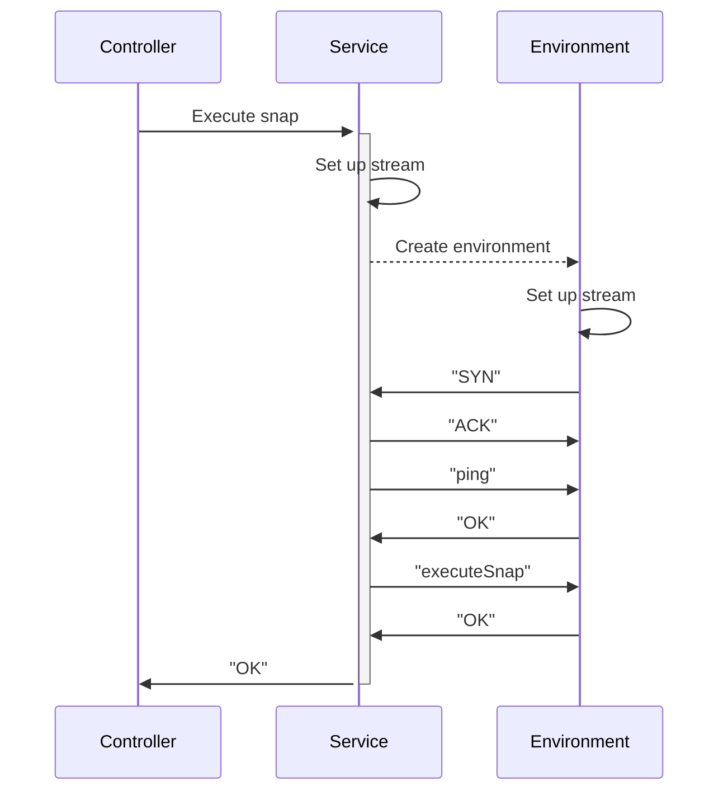
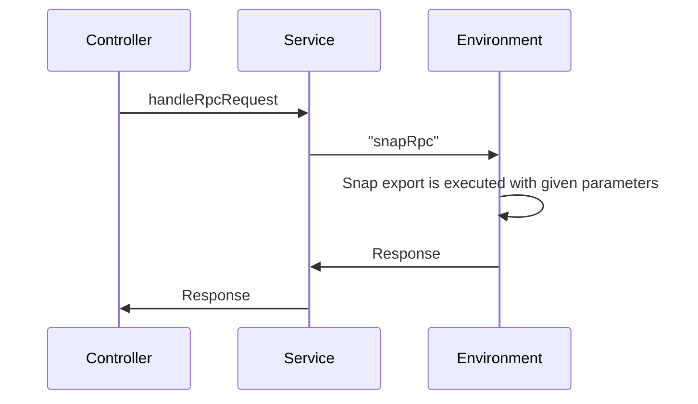

# Execution Service

The MetaMask Snaps platform has several execution **services**, not to be
confused with execution **environments**, which handle communication between the
[Snap Controller] and the [Execution Environment]. The execution service is
responsible for managing these execution environments.

Currently, the execution service supports the following execution environments:

- Iframe (Manifest V2), which creates an iframe in the extension background DOM.
- Node.js process, which spawns a new process for each snap execution.
- Node.js worker threads, which creates a new worker thread for each snap
  execution.
- Offscreen (Manifest V3), which uses the [Offscreen Document API] to create a
  proxy to the iframe execution environment.
- WebWorker (Manifest V2), which creates a web worker for each snap execution.

Generally, these execution services work as follows:

1. The [Snap Controller] calls the execution service to execute a snap.
2. The execution service creates an [Execution Environment] for the snap, e.g.,
   it creates an iframe in the extension.
3. The execution service sets up a stream using one of the [post message
   stream]s, depending on the environment.
4. The execution service calls the [Execution Environment] to execute the snap
   code in the [Execution Environment].
5. The snap is now running and ready to service requests.

After this initial boot-up, the snap is now ready to service requests, also via
JSON-RPC.

All of the communication between the [Snap Controller] and the execution service
is done through the controller messaging system in the MetaMask extension. The
execution service is hooked up to the controller messaging system, so it can
handle requests from other parts of the extension.

## Communication between Snap Controller and Execution Service

The Snap Controller and the Execution Service communicate through a well-defined
messaging system. This system ensures that the Snap Controller can manage the
execution of snaps in a secure and efficient manner. The communication process
involves the following steps:

1. **Request Handling**: The Snap Controller receives a request from a dapp or
   another part of the MetaMask extension.
2. **Execution Request**: The Snap Controller sends an execution request to the
   Execution Service, specifying the snap to be executed and any necessary
   parameters.
3. **Environment Setup**: The Execution Service sets up the appropriate
   Execution Environment for the snap, ensuring that it is isolated and secure.
4. **Stream Setup**: The Execution Service establishes a communication stream
   between the Snap Controller and the Execution Environment.
5. **Snap Execution**: The Execution Service instructs the Execution Environment
   to execute the snap code.
6. **Response Handling**: The Execution Environment processes the request and
   sends the response back to the Execution Service, which then forwards it to
   the Snap Controller.
7. **Completion**: The Snap Controller receives the response and completes the
   request, sending the result back to the original requester.

This communication process ensures that snaps are executed securely and
efficiently, with clear separation of responsibilities between the Snap
Controller and the Execution Service.

[snap controller]: ./snap-controller.md
[execution environment]: ./execution-environment.md
[post message stream]: https://github.com/MetaMask/post-message-stream
[offscreen document api]: https://developer.chrome.com/docs/extensions/reference/offscreen/
